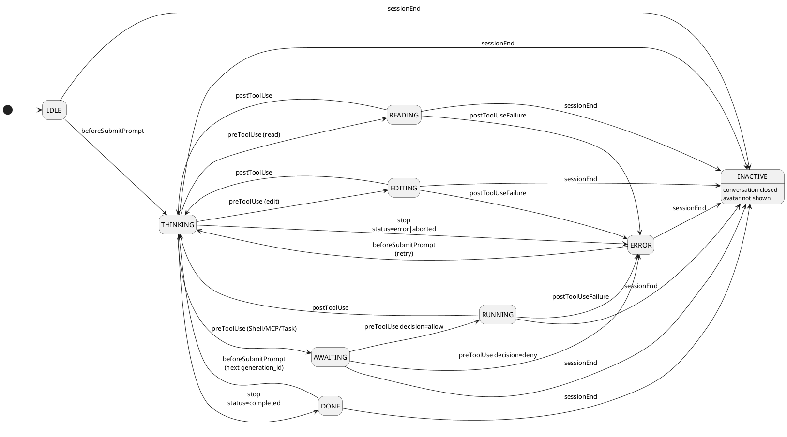

# SwarmWatch Cursor Hooks

This doc is the **canonical** reference for how SwarmWatch integrates with **Cursor** agent hooks.

Official Cursor hooks reference (for future updates):
- https://cursor.com/docs/agent/hooks

---

<!--
This file was renamed from docs/HOOKS.md to make room for a parallel docs/Claude.md.
-->

---
## 0) Architecture (end-to-end)

**Goal:** Observe agent activity and (optionally) gate risky actions via a lightweight approval loop.

**Flow:**

```text
Cursor Hook
  → spawns swarmwatch-runner (child process)
  → runner reads JSON from stdin
  → runner POSTs normalized events to SwarmWatch local control plane
      http://127.0.0.1:4100/event
  → control plane broadcasts events + approvals to the Tauri UI over WebSocket
      ws://127.0.0.1:4100
  → (if control hook) runner MAY wait for a decision (bounded)
  → runner prints stdout JSON expected by Cursor for that hook
  → runner exits (Cursor continues)
```

**Key implementation files in this repo:**

- Runner entrypoint: `src-tauri/src/bin/swarmwatch-runner.rs`
- Cursor adapter: `src-tauri/src/runner/adapters/cursor.rs`
- Local control plane (HTTP + WS): `src-tauri/src/control_plane.rs`
- UI websocket client + activity log: `src/useAgentStates.ts`
- UI renderer: `src/App.tsx`

---

## 1) Cursor: hook model overview

Cursor runs hooks by:

1. spawning a configured command (our runner)
2. writing a JSON payload to the runner's **stdin**
3. reading a hook-specific JSON response from the runner's **stdout** (or accepting an empty response)

### 1.1 Common fields (present in every Cursor hook payload)

Cursor hook stdin payloads include a common envelope (fields may vary by Cursor version):

```jsonc
{
  "conversation_id": "string",
  "generation_id": "string",
  "model": "string",
  "hook_event_name": "string",
  "cursor_version": "string",
  "workspace_roots": ["/absolute/path"],
  "user_email": "string | null",
  "transcript_path": "string | null"
}
```

SwarmWatch uses:

- `conversation_id`: **avatar identity** (per chat tab)
- `generation_id`: **run identity** (per user prompt → agent loop)

---

## 2) Avatar policy (A2/B2)

SwarmWatch uses two important policies for Cursor:

### A2 — Unblock agents (auto-allow on timeout)

For gating hooks (notably `preToolUse`):

- **read/edit tools**: runner responds immediately (auto-allow). The agent is not blocked.
- **other tools (shell/mcp/task/etc.)**: runner requests approval from the overlay UI.
  - If the user clicks **Allow** → allow.
  - If the user clicks **Deny** → deny.
  - If the user does nothing → **auto-allow after 30 seconds**.

This means the agent is never blocked indefinitely.

> Future: SwarmWatch may add persistent policy storage (“Always allow”) via a local DB.

### B2 — Only spawn avatars when `conversation_id` is valid

SwarmWatch only sends avatar events to the UI when `conversation_id` is non-empty.

If Cursor sends an empty or missing `conversation_id`:
- SwarmWatch still **fails open** (allows the hook action)
- but does **not** spawn/update an avatar in the UI.

---

## 3) Cursor hook events (implemented)

SwarmWatch currently implements these Cursor hooks:

- `beforeSubmitPrompt`
- `preToolUse`
- `postToolUse`
- `postToolUseFailure`
- `stop`
- `sessionEnd`

These are registered by the SwarmWatch integration installer in:

- `src-tauri/src/integrations.rs` → writes `~/.cursor/hooks.json`

---

## 3.1) Cursor: State → Trigger mapping (simple)

This is the “cheat sheet” mapping from **Cursor hook events** to the **SwarmWatch UI state**.

> Note: `agentInstanceId` is the Cursor `conversation_id` (one avatar per chat tab).

| SwarmWatch state | Trigger (Cursor hook) | Condition / detail | Notes |
|---|---|---|---|
| `idle` | *(UI-only)* | Shown when there are **no active sessions** | The Rust server does not seed placeholders; the overlay shows this locally. |
| `thinking` | `beforeSubmitPrompt` | Always | Start-of-run signal (per prompt / generation). |
| `reading` | `preToolUse` | `tool_name` in read group (`read_file`, `grep_search`, `list_dir`, `codebase_search`) | Fire-and-forget + **auto-allow**. |
| `editing` | `preToolUse` | `tool_name` in edit group (`edit_file`, `file_search`) | Fire-and-forget + **auto-allow**. |
| `awaiting` | `preToolUse` | Any other tool (Shell/MCP/Task/…) | Creates an approval request and waits (up to 30s). |
| `running` | `preToolUse` | **After approval allow** (or timeout auto-allow) | We emit a follow-up state update immediately when the decision arrives so the UI leaves `awaiting`. |
| `thinking` | `postToolUse` | Tool succeeded | Returns to thinking after a tool completes. |
| `error` | `preToolUse` | Approval decision = deny | Deny is treated as `error` (unified failure state); UI label should show **Denied**. |
| `error` | `postToolUseFailure` | Tool failed | Tool-level failure. |
| `done` | `stop` | `status=completed` | Successful end of run. |
| `error` | `stop` | `status=error|aborted` | Ended unsuccessfully; UI label should show **Error** or **Aborted** based on detail. |
| `inactive` | `sessionEnd` | Conversation closed | Avatar removed / no longer shown. |

---

## 3.2) Inactive semantics (critical)

`inactive` is a **dangerous** state in SwarmWatch.

Canonical meaning: the session/conversation is over and the avatar can be removed.

SwarmWatch reaches `inactive` for exactly two reasons:

1) **Explicit session end hook**: Cursor `sessionEnd` → `inactive`
2) **UI inactivity timeout** (planned policy): if no new events are received for a session for **90 seconds**, the overlay marks it `inactive`.

Notes:
- `stop` is **not** a session end signal. `stop` maps to `done|error`.
- The UI may also offer a per-session **× dismiss** control for `inactive` avatars (planned). This is not persisted and does not affect Cursor itself.

---

## 4) Hook: beforeSubmitPrompt

**Meaning:** user hits Enter / submits a prompt.

**SwarmWatch UI state:** `thinking` (uses `/public/thinking.json`).

### stdin

```jsonc
{
  "hook_event_name": "beforeSubmitPrompt",
  "conversation_id": "conv_abc123",
  "generation_id": "gen_def456",
  "prompt": "Create a new SQLite database connection module",
  "workspace_roots": ["/Users/me/project"]
}
```

### stdout

Cursor expects the `continue` schema for this hook:

```json
{ "continue": true, "user_message": "" }
```

SwarmWatch always returns `continue: true`.

---

## 5) Hook: preToolUse (PRIMARY CONTROL HOOK)

**Meaning:** agent is about to use a tool.

SwarmWatch splits this hook into two paths:

### 5.1 Auto-allow path (read/edit)

Tools in these groups are auto-allowed immediately:

- Read: `read_file`, `grep_search`, `list_dir`, `codebase_search`
- Edit: `edit_file`, `file_search`

**stdout (auto-allow):**

```json
{ "decision": "allow", "reason": "SwarmWatch: Auto-allowed (read/edit operation)" }
```

### 5.2 Approval path (everything else)

For any other `tool_name` (Shell, MCP, Task, etc.):

1. runner posts an approval request to the control plane (`POST /approval/request`)
2. UI shows buttons (allow/deny)
3. runner waits **up to 30s**
4. if no decision arrives → SwarmWatch returns **allow** (A2)

**State transitions (Cursor):**
- `THINKING -> AWAITING` when a non-read/edit tool is requested
- `AWAITING -> RUNNING` on allow (or timeout auto-allow)
- `AWAITING -> ERROR` on deny

**stdout when user denies:**

```json
{ "decision": "deny", "reason": "SwarmWatch: Blocked by user" }
```

**stdout on timeout:**

```json
{ "decision": "allow", "reason": "SwarmWatch: Timed out; auto-allowed" }
```

---

## 6) Hook: postToolUse

**Meaning:** tool execution finished successfully.

**SwarmWatch UI state:** `thinking`.

**stdout:** Cursor accepts `{}`.

---

## 7) Hook: postToolUseFailure

**Meaning:** tool execution failed.

**SwarmWatch UI state:** `error`.

**stdout:** none required.

---

## 8) Hook: stop

**Meaning:** agent loop ended.

SwarmWatch maps:

- `status=completed` → `done` (uses `/public/done.json`)
- `status=error|aborted` → `error`

**stdout:** Cursor accepts `{}`.

---

## 9) Hook: sessionEnd

**Meaning:** conversation closed.

SwarmWatch sets state to `inactive`.

**stdout:** none required.

---

## 10) Cursor hook configuration (`~/.cursor/hooks.json`)

SwarmWatch writes the hook configuration automatically via the Tauri integration installer.

The installer ensures each event contains **exactly one** SwarmWatch runner entry.

> Note: Cursor timeouts are configured per hook in `hooks.json`.
> In our implementation, the `preToolUse` hook should have the highest timeout
> because it may wait up to 30s for approvals.

---

## 11) Cursor state machine (PlantUML)



---

## 12) UI states (Lottie assets)

SwarmWatch UI states (frontend `AgentState`) are:

- `inactive`, `idle`
- `thinking` → `/public/thinking.json`
- `reading` → `/public/exp-reading.json`
- `editing` → `/public/exp-editing.json`
- `running` → `/public/base4-running.json`
- `awaiting` (approval UI) → `/public/HelpNeed.json`
- `error` → `/public/error.json`
- `done` → `/public/done.json`

---

## 13) End-to-end example: Cursor `preToolUse` (read_file)

This shows the full “wire format” for a read operation.

### 13.1 Cursor → Runner (stdin)

This JSON is written to the runner’s **stdin** by Cursor when a tool is about to run.

```json
{
  "hook_event_name": "preToolUse",
  "conversation_id": "conv_abc123",
  "generation_id": "gen_def456",
  "model": "gpt-4.1",
  "cursor_version": "0.49.6",
  "workspace_roots": ["/Users/me/project"],
  "user_email": null,
  "transcript_path": null,

  "tool_name": "read_file",
  "tool_input": {
    "path": "src/App.tsx"
  }
}
```

### 13.2 Runner → Control Plane (HTTP)

The runner normalizes and posts an `agent_state` event:

`POST http://127.0.0.1:4100/event`

```json
{
  "type": "agent_state",
  "agentFamily": "cursor",
  "agentInstanceId": "conv_abc123",
  "agentKey": "",
  "agentName": "Cursor",
  "state": "reading",
  "detail": "read_file",
  "hook": "preToolUse",
  "projectName": "project",
  "ts": 1739000000
}
```

Notes:
- `agentKey` is ignored by the server and recomputed as `${agentFamily}:${agentInstanceId}`.
- `projectName` is derived from `workspace_roots[0]` (basename only).
- `ts` is set by the runner at send-time (epoch seconds).

### 13.3 Control Plane → Runner (HTTP response)

The control plane replies:

```json
{ "ok": true }
```

### 13.4 Runner → Cursor (stdout)

For read/edit tools, SwarmWatch is fire-and-forget and **auto-allows**:

```json
{ "decision": "allow", "reason": "SwarmWatch: Auto-allowed (read/edit operation)" }
```

### 13.5 Control Plane → UI (WebSocket message)

All connected UI clients receive the normalized event:

```json
{
  "type": "agent_state",
  "agentFamily": "cursor",
  "agentInstanceId": "conv_abc123",
  "agentKey": "cursor:conv_abc123",
  "agentName": "Cursor",
  "state": "reading",
  "detail": "read_file",
  "hook": "preToolUse",
  "projectName": "project",
  "ts": 1739000000
}
```
